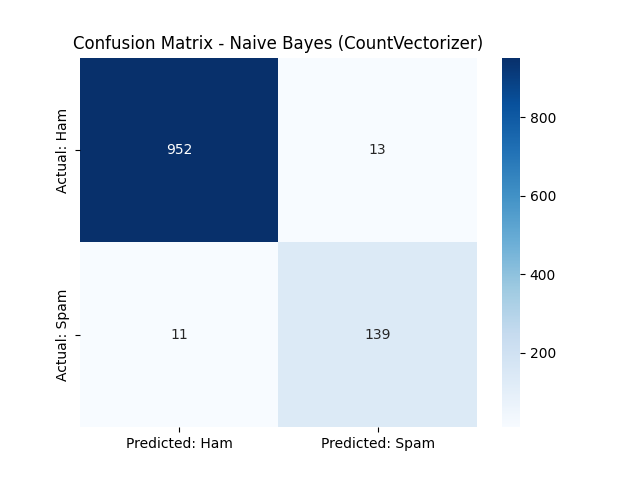

# SMS Spam Classifier 📩

My second machine learning project — classifying SMS messages as spam or ham (legitimate) using NLP techniques.

## What I did

- Cleaned raw dataset (dropped junk columns, renamed to `label` and `message`)
- Converted labels to numeric (ham=0, spam=1)
- Converted message text into numeric features using two techniques:
  - **CountVectorizer** (Bag of Words)
  - **TF-IDF** (Term Frequency - Inverse Document Frequency)
- Trained a **Multinomial Naive Bayes** model on both feature sets
- Evaluated using accuracy, confusion matrix, precision, recall, and F1-score

## Results

| Vectorizer      | Accuracy | Spam Precision | Spam Recall | Spam F1-score |
| --------------- | -------- | -------------- | ----------- | ------------- |
| CountVectorizer | 97.85%   | 0.91           | 0.93        | 0.92          |
| TF-IDF          | 96.23%   | 1.00           | 0.72        | 0.84          |

**Final model chosen: CountVectorizer + Naive Bayes** — better F1-score and recall, meaning it catches more actual spam, which matters more for this use case than TF-IDF's perfect (but overly cautious) precision.

## Confusion Matrix

## Tech used

Python, pandas, scikit-learn, seaborn, matplotlib

## What I learned

- How to convert text into numeric features (Bag of Words vs TF-IDF)
- Why accuracy alone is misleading on imbalanced data (86.6% ham vs 13.4% spam)
- Precision vs Recall tradeoff — and how to choose a model based on which type of error matters more for the real-world use case
- Multinomial Naive Bayes for text classification
